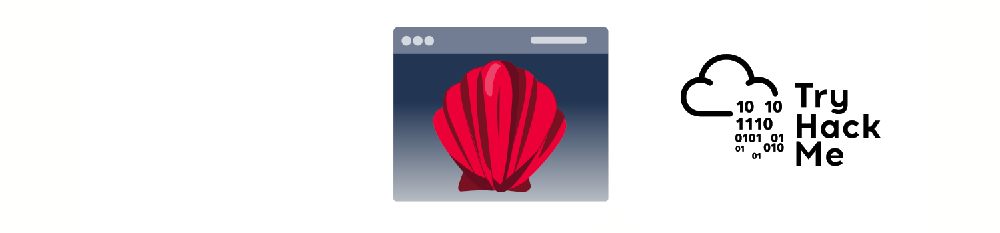

# Introduction

|  |
|:--:|
| [THM Room: AV Evasion: Shellcode](https://tryhackme.com/room/avevasionshellcode) |

## What?

* Making shellcodes.
* Exploring the pros and cons of staged payloads.
* Creating stealthy shellcodes to avoid AV detection.

## Why?

Building and delivering payloads for avoiding detection by common AV engines.

## How?

* [Basic assembly shellcode](shell.md)
* [Generate shellcode](generate.md)
* [Staged vs stageless payloads](staged.md)
* [Encoding and encrypting shellcode](enc.md)
* [Packers](packers.md)
* [Binders](binders.md)

