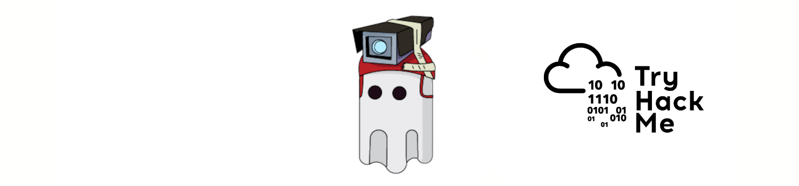

# Introduction

|  |
|:--:|
| [THM Room: Evading Logging and Monitoring](https://tryhackme.com/room/monitoringevasion) |

## What?

Address Event Tracing for Windows (ETW) and its weaknesses.

## Why?

Evade or disable ETW-based solutions.

## How?

* [Study ETW](etw.md)
* [Powershell reflection](ps-reflection.md)
* [Patching tracing functions](patching.md)

