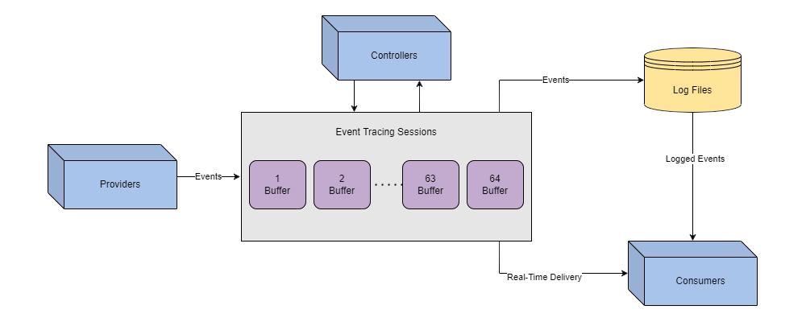

# Study ETW

Almost all event logging capability within Windows is handled from ETW at both the application and kernel level. While 
there are other services in place like Event Logging and Trace Logging, these are either extensions of ETW or less 
prevalent to attackers.

| Component   | Purpose                      |
|:------------|:-----------------------------|
| Controllers | Build and configure sessions |
| Providers   | Generate events              |
| Consumers   | Interpret events             |

While less important to an attacker than components, event IDs are a core feature of Windows logging. Events are 
sent and transferred in XML format, the standard for how events are defined and implemented by providers.

ETW has visibility over a majority of the operating system, whereas logging generally has limited visibility or detail. 
The best approach to taking down ETW is to limit its insight as much as possible into the operation while maintaining 
environment integrity.

## Approaches

With security best practices in place, it is typical for a modern environment to employ log forwarding. Log forwarding 
means that the SOC will move or “forward” logs from the host machine to a central server or indexer. Even if an 
attacker can delete logs from the host machine, they could already be off of the device and secured.

Destroying all logs before they were forwarded can present serious suspicion and lead to an investigation. Even if 
an attacker did control what logs were removed and forwarded, defenders could still track the tampering.

These IDs can monitor the process of destroying logs or “log smashing” and pose a clear risk to be detected.

| Event ID | Purpose                                               |
|:---------|:------------------------------------------------------|
| 1102     | Logs when the Windows Security audit log was cleared  |
| 104      | Logs when the log file was cleared                    |
| 1100     | Logs when the Windows Event Log service was shut down |

It is possible to bypass these mitigations further or tamper with the logs, but when approaching an environment, 
as a red team we do not know which security practices are in place, and it is better to take an OPSEC approach: 
Focus on what logs a malicious technique may result in to keep an environment's integrity intact. Knowing what may 
be instrumented against an approach.

Most published techniques will target ETW components since that will allow an attacker the most control over the 
tracing process. There are also some new interesting techniques.

## ETW Instrumentation

|  |
|:--:|
| The data/session flow within ETW. |

## Resources

* [Microsoft: About Event Tracing](https://learn.microsoft.com/en-us/windows/win32/etw/about-event-tracing)
* [Microsoft: Trace Message Format File](https://learn.microsoft.com/en-us/windows-hardware/drivers/devtest/trace-message-format-file)
