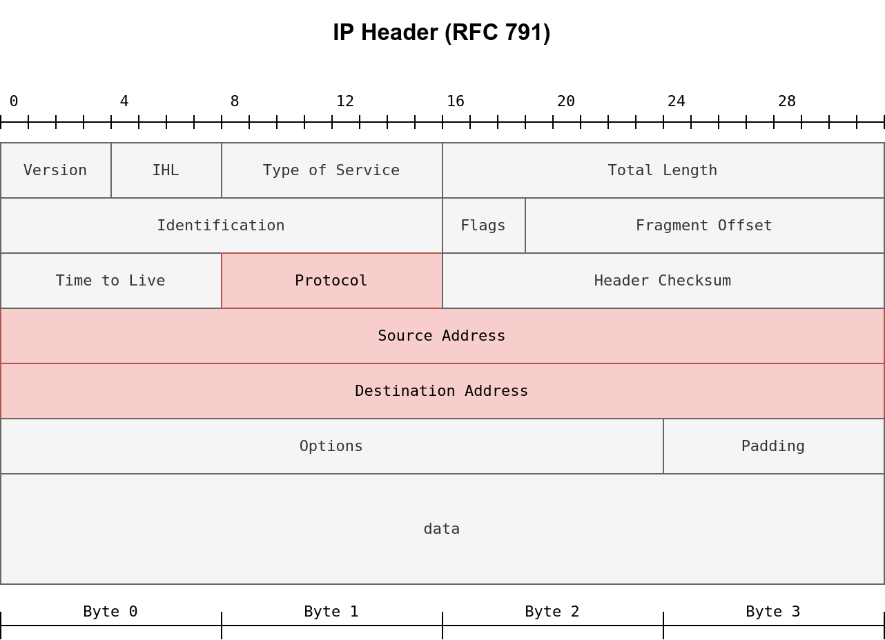
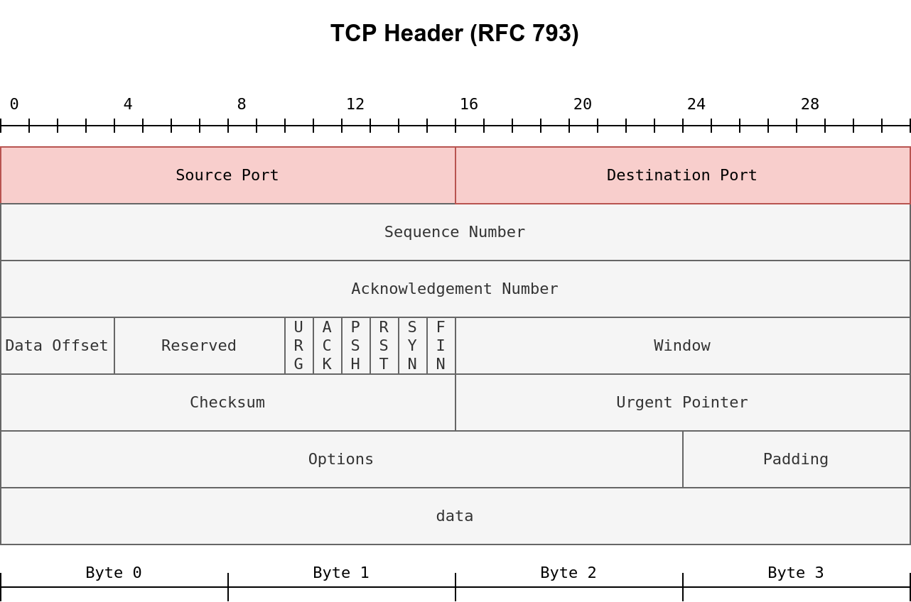

# Firewall systems

Different types of firewalls are capable of inspecting packet fields. The most basic firewalls are able to inspect 
at least the following fields:

* Protocol
* Source Address
* Destination Address

|  |
|:--:|
| Depending on the protocol field, the data in the IP datagram can be one of many options.  Three common protocols are TCP, UDP, and ICMP. |

In the case of TCP or UDP, the firewall should at least be able to check the TCP and UDP headers for `Source Port` 
number and `Destination Port` number.

|  |
|:--:|
| Even the most limited of firewalls should give the firewall administrator control over  allowed or blocked source and destination port numbers. |

## Classification of firewalls

There are multiple ways to classify firewalls:

* Whether they are independent appliances (hardware vs software).
* Who/what they protect (personal vs commercial).
* Firewall inspection abilities (red team perspective).

## Firewall inspection abilities

Firewalls focus on layers 3 and 4 and, to a lesser extent, layer 2. Next-generation firewalls are also designed to 
cover layers 5, 6, and 7. The more layers a firewall can inspect, the more sophisticated it gets and the more 
processing power it needs.

Based on firewall abilities, we can list the following firewall types:

### Packet-Filtering Firewall

Packet-filtering is the most basic type of firewall. This type of firewall inspects the protocol, source and 
destination IP addresses, and source and destination ports in the case of TCP and UDP datagrams. 
It is a stateless inspection firewall.

### Circuit-Level Gateway

In addition to the features offered by the packet-filtering firewalls, circuit-level 
gateways can provide additional capabilities, such as checking TCP three-way-handshake against the firewall rules.

### Stateful Inspection Firewall

Compared to the previous types, this type of firewall gives an additional layer of 
protection as it keeps track of the established TCP sessions. As a result, it can detect and block any TCP packet 
outside an established TCP session.

### Proxy Firewall

A proxy firewall is also referred to as Application Firewall (AF) and Web Application Firewall (WAF). 
It is designed to masquerade as the original client and requests on its behalf. This process allows the proxy firewall 
to inspect the contents of the packet payload instead of being limited to the packet headers. Generally speaking, 
this is used for web applications and does not work for all protocols.

### Next-Generation Firewall (NGFW) 

NGFW offers the highest firewall protection. It can practically monitor all network 
layers, from OSI Layer 2 to OSI Layer 7. It has application awareness and control. Examples include the Juniper SRX 
series and Cisco Firepower.

### Cloud Firewall or Firewall as a Service (FWaaS)

FWaaS replaces a hardware firewall in a cloud environment. Its 
features might be comparable to NGFW, depending on the service provider; however, it benefits from the scalability 
of cloud architecture. One example is Cloudflare Magic Firewall, which is a network-level firewall. Another example is 
Juniper vSRX; it has the same features as an NGFW but is deployed in the cloud. It is also worth mentioning AWS WAF 
for web application protection and AWS Shield for DDoS protection.
