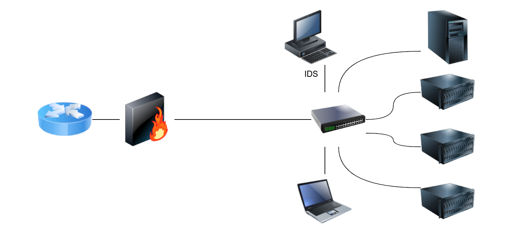
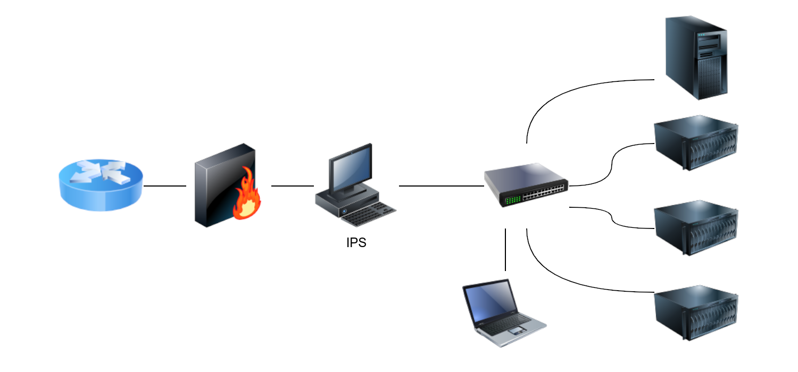

# IDS/IPS systems

## Intrusion detection

IDS setups can be divided based on their location in the network into:

* Host-based IDS (HIDS)
* Network-based IDS (NIDS)

The host-based IDS (HIDS) is installed on an OS along with the other running applications. This setup will give the HIDS the ability to monitor the traffic going in and out of the host; moreover, it can monitor the processes running on the host.

The network-based IDS (NIDS) is a dedicated appliance or server to monitor the network traffic. The NIDS should be connected so that it can monitor all the network traffic of the network or VLANs we want to protect. This can be achieved by connecting the NIDS to a monitor port on the switch. The NIDS will process the network traffic to detect malicious traffic.

|  |
|:--:|
| Snort as signature-based network IDS. |

## Intrusion prevention

For Snort to function as an IPS, it needs some mechanism to block (drop) offending connections. This capability 
requires Snort to be set up as inline and to bridge two or more network cards.

|  |
|:--:|
| Snort as an IPS if set up inline. |

## IDS Engine types

The detection engine of an IDS can be:

* Signature-based: A signature-based IDS requires full knowledge of malicious (or unwanted) traffic. In other words, we need to explicitly feed the signature-based detection engine the characteristics of malicious traffic. Teaching the IDS about malicious traffic can be achieved using explicit rules to match against.
* Anomaly-based: This requires the IDS to have knowledge of what regular traffic looks like. In other words, we need to “teach” the IDS what normal is so that it can recognize what is not normal. Teaching the IDS about normal traffic, i.e., baseline traffic can be achieved using machine learning or manual rules.

## Rule triggering examples

Drop all ICMP traffic passing through Snort IPS (drop any packet of type ICMP from any source IP address (on any port) 
to any destination IP address (on any port)):

    drop icmp any any -> any any (msg: "ICMP Ping Scan"; dsize:0; sid:1000020; rev: 1;)

Detect the term `ncat` in the payload of the traffic exchanged with our webserver:

    alert tcp any any <> any 80 (msg: "Netcat Exploitation"; content:"ncat"; sid: 1000030; rev:1;)

If we expect to see it in HTTP `POST` requests (`flow:established` tells the Snort engine to look at streams 
started by a TCP 3-way handshake (established connections)). 

    alert tcp any any <> any 80 (msg: "Netcat Exploitation"; flow:established,to_server; content:"POST"; nocase; http_method; content:"ncat"; nocase; sid:1000032; rev:1;)

## Resources

* [Writing Snort Rules with Examples and Cheat Sheet](https://cyvatar.ai/write-configure-snort-rules/)