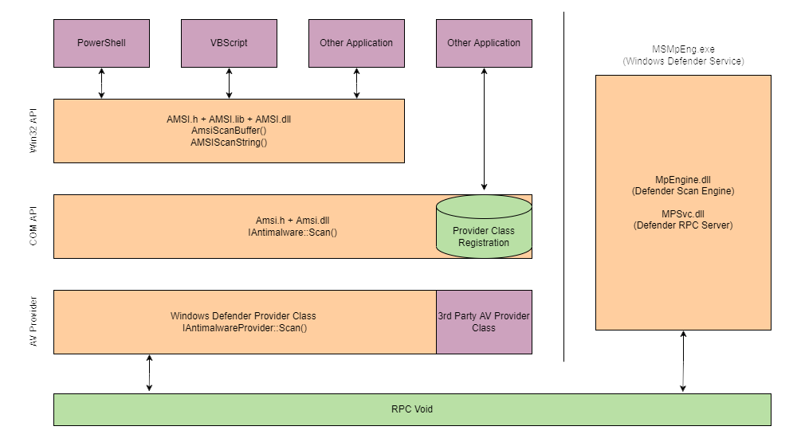

# Study AMSI

AMSI (Anti-Malware Scan Interface) is a PowerShell security feature that will allow any applications or services to 
integrate directly into anti-malware products. Defender instruments AMSI to scan payloads and scripts before execution 
inside the .NET runtime. 

From Microsoft: _"The Windows Antimalware Scan Interface (AMSI) is a versatile interface standard that allows your applications and services to integrate with any anti-malware product that's present on a machine. AMSI provides enhanced malware protection for your end-users and their data, applications, and workloads."_

AMSI will determine its actions from a response code as a result of monitoring and scanning:

    AMSI_RESULT_CLEAN = 0
    AMSI_RESULT_NOT_DETECTED = 1
    AMSI_RESULT_BLOCKED_BY_ADMIN_START = 16384
    AMSI_RESULT_BLOCKED_BY_ADMIN_END = 20479
    AMSI_RESULT_DETECTED = 32768

These response codes will only be reported on the backend of AMSI or through third-party implementation. If AMSI 
detects a malicious result, it will halt execution and send an error message.

```text
PS C:Users\Tryhackme> 'Invoke-Hacks'
At line:1 char:1
+ "Invoke-Hacks"
+ ~~~~~~~~~~~~~~
This script contains malicious content and has been blocked by your antivirus software.
		+ CategoryInfo          : ParserError: (:) []. ParentContainsErrorRecordException
		+ FullyQualifiedErrorId : ScriptContainedMaliciousContent
```

AMSI is fully integrated into the following Windows components:

* User Account Control, or UAC
* PowerShell
* Windows Script Host (wscript and cscript)
* JavaScript and VBScript
* Office VBA macros

When targeting the above components, attackers need to be mindful of AMSI and its implementations when executing code 
or abusing components.

The way AMSI is instrumented can be complex, including multiple DLLs and varying execution strategies depending on 
where it is instrumented. By definition, AMSI is only an interface for other anti-malware products; AMSI will use 
multiple provider DLLs and API calls depending on what is being executed and at what layer it is being executed.

|  |
|:--:|
| How data is dissected as it flows through the layers and what DLLs/API calls are being instrumented. |

|  |
|:--:|
| Break down into core components. |

Note: AMSI is only instrumented when loaded from memory when executed from the `CLR`. It is assumed that if on disk 
`MsMpEng.exe` (Windows Defender) is already being instrumented.

Most of the known bypasses are placed in the `Win32` API layer, manipulating the `AmsiScanBuffer` API call. 

To find where AMSI is instrumented, use InsecurePowerShell, a GitHub fork of PowerShell with security features removed. 
Look through the compared commits and observe any security features. AMSI is only instrumented in twelve lines of 
code under `src/System.Management.Automation/engine/runtime/CompiledScriptBlock.cs`:

```text
var scriptExtent = scriptBlockAst.Extent;
 if (AmsiUtils.ScanContent(scriptExtent.Text, scriptExtent.File) == AmsiUtils.AmsiNativeMethods.AMSI_RESULT.AMSI_RESULT_DETECTED)
 {
  var parseError = new ParseError(scriptExtent, "ScriptContainedMaliciousContent", ParserStrings.ScriptContainedMaliciousContent);
  throw new ParseException(new[] { parseError });
 }

 if (ScriptBlock.CheckSuspiciousContent(scriptBlockAst) != null)
 {
  HasSuspiciousContent = true;
 }
```

## Resources

* [AMSI Bypass Methods](https://pentestlaboratories.com/2021/05/17/amsi-bypass-methods/)
* [Antimalware Scan Interface (AMSI)](https://learn.microsoft.com/en-us/windows/win32/amsi/antimalware-scan-interface-portal)
* [Antimalware Scan Interface (AMSI) functions](https://learn.microsoft.com/en-us/windows/win32/amsi/antimalware-scan-interface-functions)
* [IAmsiStream interface (amsi.h)](https://learn.microsoft.com/en-us/windows/win32/api/amsi/nn-amsi-iamsistream)
* [cobbr/InsecurePowerShell](https://github.com/cobbr/InsecurePowerShell)
* [Removed security features in PowerShell](https://github.com/PowerShell/PowerShell/compare/master...cobbr:master)
* [cobbr/PSAmsi](https://github.com/cobbr/PSAmsi)
