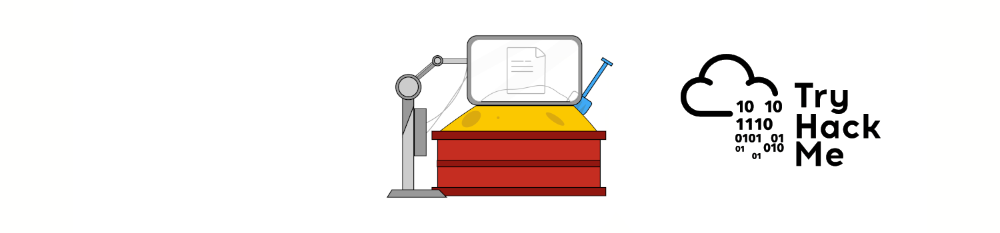

# Introduction

|  |
|:--:|
| [THM Room: Sandbox evasion](https://tryhackme.com/room/sandboxevasion) |

## What?

Learn about active defense mechanisms Blue Teamers can deploy to identify adversaries in their environment.

## Why?

To escape those.

## How?

* [An adversary walks into a sandbox](bar.md)
* [Common sandbox evasion techniques](techniques.md)
* [Implementing evasion techniques](implementation.md)
* [The Great Escape](escape.md)

