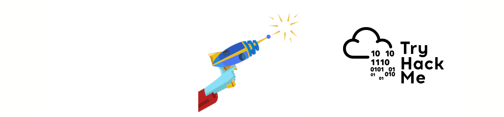

# Introduction

|  |
|:--:|
| [THM Room: Signature Evasion](https://tryhackme.com/room/signatureevasion) |

## What?

Break signatures using modern tool-agnostic approaches. 

## Why?

Evade common AV.

## How?

* [Signature identification](identification.md)
* [Static code-based signatures](code-based.md)
* [Static property-based signatures](property-based.md)
* [Behavioural signatures](behavioural.md)
* [Challenge](challenge.md)
