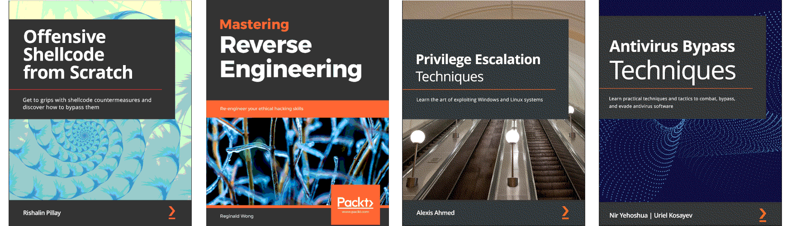

Nature's cheats
==============================================

Tools like nmap are very noisy and non-stealthy and can easily get picked up by devices such as firewalls
and IDS. Dropping a payload on a target host, can get picked up by the Anti Virus or EDR solution. To avoid these
detections, it is important to employ techniques that will bypass these defense mechanisms.

.. image:: _static/images/in-progress.png
  :alt: Forever in progress ...

----

.. toctree::
   :maxdepth: 1
   :includehidden:
   :caption: Testlab

   Virtual machines <https://red.tymyrddin.dev/projects/testlab/en/latest/docs/vm/README.html>
   Assemblers <https://red.tymyrddin.dev/projects/testlab/en/latest/docs/asm/README.html>
   Compilers <https://red.tymyrddin.dev/projects/testlab/en/latest/docs/com/README.html>
   Disassemblers <https://red.tymyrddin.dev/projects/testlab/en/latest/docs/dis/README.html>
   Debuggers <https://red.tymyrddin.dev/projects/testlab/en/latest/docs/deb/README.html>
   Decompilers <https://red.tymyrddin.dev/projects/testlab/en/latest/docs/dec/README.html>
   Exploit development <https://red.tymyrddin.dev/projects/testlab/en/latest/docs/edt/README.html>
   Exploitation tools <https://red.tymyrddin.dev/projects/testlab/en/latest/docs/exploitation/README.html>

----

.. toctree::
   :glob:
   :maxdepth: 1
   :includehidden:
   :caption: Process injection

   docs/injection/README.md
   docs/injection/shell.md
   docs/injection/hollowing.md
   docs/injection/thread.md
   docs/injection/dll.md
   docs/injection/pe.md
   docs/injection/trickbot.md

.. toctree::
   :glob:
   :maxdepth: 1
   :includehidden:
   :caption: AV evasion

   docs/av/README.md
   docs/av/shell.md
   docs/av/generate.md
   docs/av/staged.md
   docs/av/enc.md
   docs/av/packers.md
   docs/av/binders.md

.. toctree::
   :glob:
   :maxdepth: 1
   :includehidden:
   :caption: Obfuscation basics

   docs/obfuscation/README.md
   docs/obfuscation/principles.md
   docs/obfuscation/info.md

.. toctree::
   :glob:
   :maxdepth: 1
   :includehidden:
   :caption: Signature evasion

   docs/signature/README.md
   docs/signature/identification.md
   docs/signature/code-based.md
   docs/signature/property-based.md
   docs/signature/behavioural.md
   docs/signature/challenge.md

.. toctree::
   :glob:
   :maxdepth: 1
   :includehidden:
   :caption: Bypassing UAC

   docs/uac/README.md
   docs/uac/gui.md
   docs/uac/autoelevate.md
   docs/uac/fodhelper.md
   docs/uac/env-expansion.md
   docs/uac/auto-exploit.md

.. toctree::
   :glob:
   :maxdepth: 1
   :includehidden:
   :caption: Runtime detection evasion

   docs/runtime/README.md
   docs/runtime/amsi.md
   docs/runtime/downgrade.md
   docs/runtime/reflection.md
   docs/runtime/patching.md
   docs/runtime/automation.md

.. toctree::
   :glob:
   :maxdepth: 1
   :includehidden:
   :caption: Evading logging and monitoring

   docs/etw/README.md
   docs/etw/etw.md
   docs/etw/ps-reflection.md
   docs/etw/patching.md
   docs/etw/takeover.md
   docs/etw/pipeline.md
   docs/etw/challenge.md

.. toctree::
   :glob:
   :maxdepth: 1
   :includehidden:
   :caption: Living off the land

   docs/land/README.md
   docs/land/sysinternals.md
   docs/land/lolbas.md
   docs/land/operations.md
   docs/land/execution.md
   docs/land/app-whitelisting.md
   docs/land/shortcuts.md
   docs/land/no-ps.md
   docs/land/astaroth.md

.. toctree::
   :glob:
   :maxdepth: 1
   :includehidden:
   :caption: Network security solutions

   docs/netsec/README.md
   docs/netsec/systems.md
   docs/netsec/protocol.md
   docs/netsec/payload.md
   docs/netsec/route.md
   docs/netsec/dos.md
   docs/netsec/c2.md
   docs/netsec/nextgen.md

.. toctree::
   :glob:
   :maxdepth: 1
   :includehidden:
   :caption: Firewalls

   docs/firewalls/README.md
   docs/firewalls/systems.md
   docs/firewalls/source-port.md
   docs/firewalls/fragmentation.md
   docs/firewalls/header-fields.md
   docs/firewalls/hopping.md
   docs/firewalls/tunnelling.md
   docs/firewalls/non-standard-ports.md
   docs/firewalls/nextgen.md

.. toctree::
   :glob:
   :maxdepth: 1
   :includehidden:
   :caption: Sandbox evasion

   docs/sandbox/README.md
   docs/sandbox/bar.md
   docs/sandbox/techniques.md
   docs/sandbox/implementation.md
   docs/sandbox/escape.md

----

